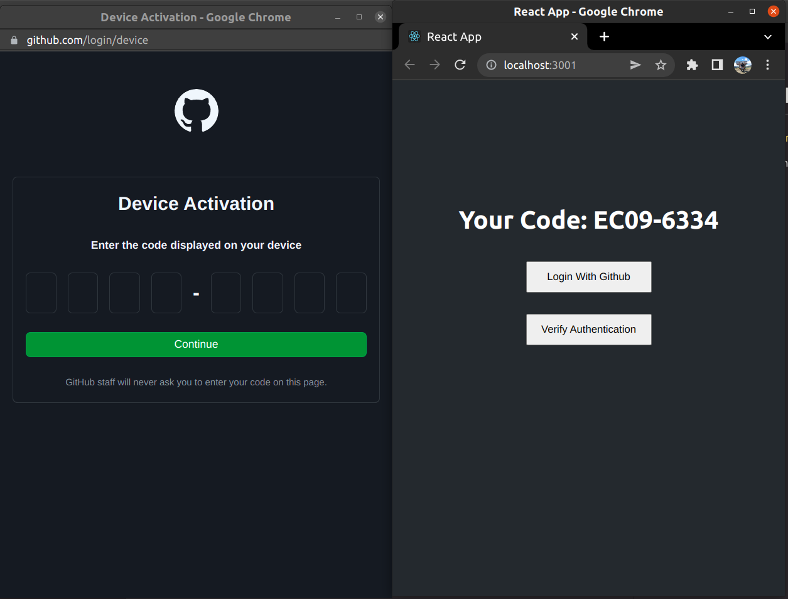

# Ordering UI 

UI for [Ordering API Demo](https://github.com/EdwinWalela/ordering)

Oauth2 flow using Github as auth provider

<center>

</center>

## Running locally

Clone repo 

```
git clone https://github.com/EdwinWalela/ordering-ui
```

Install dependancies

```
npm install
```

Start app

```
npm start
```

```bash
You can now view ordering-ui in the browser.

  Local:            http://localhost:3001
  On Your Network:  http://192.168.100.2:3001

Note that the development build is not optimized.
To create a production build, use npm run build.

webpack compiled successfully
```